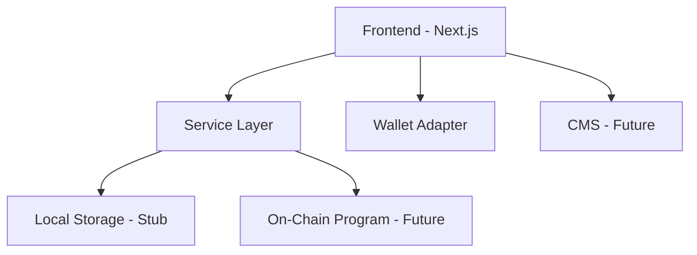
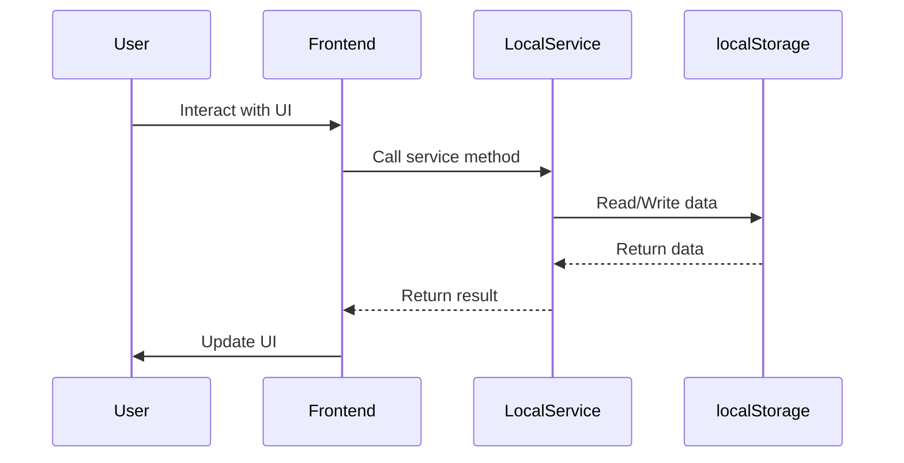
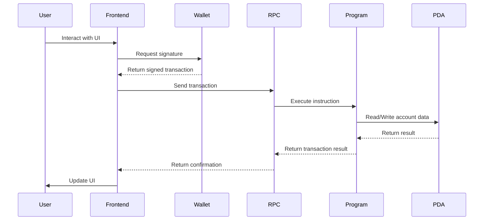

# Architecture Overview

## System Architecture

Superteam Academy is built as a modern web application with a focus on progressive enhancement and future on-chain integration.

### High-Level Architecture



## Component Structure

### Frontend Layer

**Framework**: Next.js 14 (App Router)
- Server Components for static content
- Client Components for interactive elements
- Hybrid rendering for optimal performance

**State Management**:
- React Context for global state
- Local component state for UI interactions
- Service layer for business logic

### Service Layer

The core of the application follows a service-oriented architecture:

```typescript
interface LearningProgressService {
  getProgress(userId: string, courseId: string): Promise<Progress>;
  completeLesson(userId: string, courseId: string, lessonIndex: number): Promise<void>;
  getXP(userId: string): Promise<number>;
  getStreak(userId: string): Promise<StreakData>;
  getLeaderboard(timeframe: 'weekly' | 'monthly' | 'alltime'): Promise<LeaderboardEntry[]>;
  getCredentials(wallet: PublicKey): Promise<Credential[]>;
}
```

**Current Implementation**: `LocalLearningProgressService`
- Uses browser localStorage for persistence
- Simulates on-chain behavior
- Ready for program integration

**Future Implementation**: `OnChainLearningProgressService`
- Connects to Solana program at `github.com/solanabr/superteam-academy`
- Uses wallet signatures for authentication
- Stores data on-chain via PDAs

### Data Models

#### User Progress
```typescript
interface Progress {
  courseId: string;
  completedLessons: number;
  totalLessons: number;
  completionPercentage: number;
  lastActive: Date;
}
```

#### XP & Leveling
```typescript
// XP is stored as soulbound Token-2022 balance
// Level calculation: Level = floor(sqrt(totalXP / 100))
```

#### Streaks
```typescript
interface StreakData {
  currentStreak: number;
  longestStreak: number;
  lastActivityDate: Date;
  streakCalendar: Record<string, boolean>; // Date strings as keys
}
```

#### Credentials
```typescript
interface Credential {
  id: string;
  name: string;
  description: string;
  imageUrl: string;
  level: number;
  mintAddress: string; // Bubblegum compressed NFT
  metadata: any;
  verificationLink: string;
}
```

## On-Chain Integration Points

### Current Stub Implementation

All learning data is stored in localStorage with the following structure:

```json
{
  "learningProgress": {
    "user1:solana-fundamentals": {
      "courseId": "solana-fundamentals",
      "completedLessons": 2,
      "totalLessons": 10,
      "completionPercentage": 20,
      "lastActive": "2024-02-13T12:00:00.000Z"
    }
  },
  "userXP": {
    "user1": "450"
  },
  "userStreak": {
    "user1": {
      "currentStreak": 3,
      "longestStreak": 5,
      "lastActivityDate": "2024-02-13T12:00:00.000Z",
      "streakCalendar": {
        "2024-02-11": true,
        "2024-02-12": true,
        "2024-02-13": true
      }
    }
  }
}
```

### Future On-Chain Implementation

#### Account Structure

1. **Learner PDA**: Main user account
   - `owner`: User's wallet public key
   - `xp`: u64 (soulbound token balance)
   - `achievements`: [u8; 32] (256-bit bitmap)
   - `bump`: u8

2. **Enrollment PDA**: Per-course enrollment
   - `learner`: Learner PDA public key
   - `course`: Course public key
   - `progress`: u64 (bitfield for lesson completion)
   - `started_at`: i64 (timestamp)
   - `completed_at`: Option<i64>
   - `bump`: u8

3. **Course PDA**: Course metadata
   - `authority`: Program authority
   - `name`: String
   - `description`: String
   - `difficulty`: u8
   - `total_lessons`: u8
   - `xp_reward`: u64
   - `bump`: u8

#### Program Instructions

```rust
// Initialize learner account
pub fn initialize_learner(ctx: Context<InitializeLearner>) -> Result<()> { ... }

// Enroll in course
pub fn enroll(ctx: Context<Enroll>, course: Pubkey) -> Result<()> { ... }

// Complete lesson
pub fn complete_lesson(
    ctx: Context<CompleteLesson>,
    course: Pubkey,
    lesson_index: u8
) -> Result<()> { ... }

// Claim achievement
pub fn claim_achievement(ctx: Context<ClaimAchievement>, achievement_id: u8) -> Result<()> { ... }

// Close enrollment (reclaim rent)
pub fn close_enrollment(ctx: Context<CloseEnrollment>, course: Pubkey) -> Result<()> { ... }
```

## Data Flow

### Current Flow (Stubbed)



### Future Flow (On-Chain)



## Performance Optimization

### Frontend Performance

- **Code Splitting**: Next.js automatic code splitting
- **Lazy Loading**: Dynamic imports for heavy components
- **Image Optimization**: Next.js Image component with CDN support
- **Bundle Analysis**: Regular bundle size monitoring

### Data Fetching

- **Static Generation**: For course catalog and marketing pages
- **Client-side Fetching**: For user-specific data
- **Caching**: React Query for service calls
- **Optimistic Updates**: For immediate UI feedback

## Security Considerations

### Current Implementation

- Wallet adapter for secure authentication
- Local storage with user-scoped keys
- No sensitive data storage

### Future Considerations

- **Transaction Signing**: All on-chain calls require wallet signature
- **PDA Ownership**: Enrollment PDAs owned by learner
- **Program Security**: Rust-based program with proper validation
- **Rate Limiting**: Prevent abuse of XP system

## Internationalization

### Current Implementation

- Language switcher component
- Basic routing for language support
- Ready for i18n library integration

### Future Implementation

```javascript
// next-i18next configuration
module.exports = {
  i18n: {
    locales: ['en', 'pt', 'es'],
    defaultLocale: 'en',
    domains: [
      {
        domain: 'superteam.academy',
        defaultLocale: 'en',
      },
      {
        domain: 'superteam.academy/pt',
        defaultLocale: 'pt',
      },
      {
        domain: 'superteam.academy/es',
        defaultLocale: 'es',
      },
    ],
  },
}
```

## Analytics & Monitoring

### Current Implementation

- Basic error boundaries
- Console logging for development

### Future Implementation

- **Google Analytics 4**: User behavior tracking
- **Sentry**: Error monitoring and reporting
- **Hotjar/PostHog**: Heatmaps and session recordings
- **Custom Events**: Track learning progress and engagement

## Deployment Strategy

### Environments

- **Development**: Local with mock data
- **Staging**: Vercel preview deployments
- **Production**: Vercel with custom domain

### CI/CD Pipeline

```yaml
# Example GitHub Actions workflow
name: Deploy
on: [push]
jobs:
  test:
    runs-on: ubuntu-latest
    steps:
      - uses: actions/checkout@v4
      - uses: actions/setup-node@v4
      - run: npm install
      - run: npm run lint
      - run: npm run typecheck
      - run: npm run test
  
  deploy:
    needs: test
    runs-on: ubuntu-latest
    steps:
      - uses: actions/checkout@v4
      - uses: actions/setup-node@v4
      - run: npm install
      - run: npm run build
      - uses: vercel/action@v1
        with:
          vercel-token: ${{ secrets.VERCEL_TOKEN }}
          vercel-org-id: ${{ secrets.VERCEL_ORG_ID }}
          vercel-project-id: ${{ secrets.VERCEL_PROJECT_ID }}
```

## Migration Path to On-Chain

### Step 1: Service Layer Abstraction
- ✅ Complete - `LearningProgressService` interface defined
- ✅ Complete - Local implementation for development

### Step 2: Wallet Integration
- ✅ Complete - Solana Wallet Adapter integrated
- ✅ Complete - Wallet connection for authentication

### Step 3: On-Chain Program
- ❌ Pending - Develop Solana program
- ❌ Pending - Deploy to Devnet
- ❌ Pending - Implement on-chain service

### Step 4: Data Migration
- ❌ Pending - Migration script for existing users
- ❌ Pending - Dual-write period (local + on-chain)
- ❌ Pending - Full cutover to on-chain

### Step 5: Advanced Features
- ❌ Pending - Compressed NFT credentials
- ❌ Pending - Soulbound XP tokens
- ❌ Pending - On-chain leaderboard indexing

## Monitoring & Maintenance

### Health Checks
- Uptime monitoring
- Performance metrics
- Error rate tracking

### Scaling Strategy
- Horizontal scaling with Vercel
- Database optimization (when added)
- Caching layer for frequent queries

## Conclusion

The current implementation provides a fully functional learning platform with all core features working in a stubbed environment. The architecture is designed for seamless transition to on-chain operations when the Solana program is available.

The service layer abstraction ensures that switching from local storage to on-chain calls will require minimal changes to the frontend components.